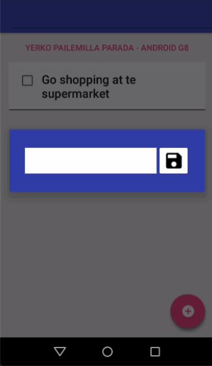

# Stressless

Repository corresponding to the challenge E5.

> What is Stressless?

This is a *To do list* app that helps individuals achieve their goals.

> What can you do in this application?

* Add and remove items from the To do list.
* Add a description to item on the To do list.
* Delete item with a click on the checkbox to To do list.

> What are the additional features?

* The list is persisted properly when the app is restarted using SugarORM.
* Use a DialogFragment for adding To do items.
* Contains visual animations on floating action button (FAB).

## Preview

## License

* [Apache 2.0](http://www.apache.org/licenses/LICENSE-2.0.html)
* [Maven](https://maven.apache.org/)

## Authors

* **Yerko Pailemilla Parada** - *Developer* - [yerkopailemilla](https://github.com/yerkopailemilla)

## Learnings achieved

* [SugarORM](https://satyan.github.io/sugar/)
* [DialogFragment](https://developer.android.com/reference/android/app/DialogFragment)
